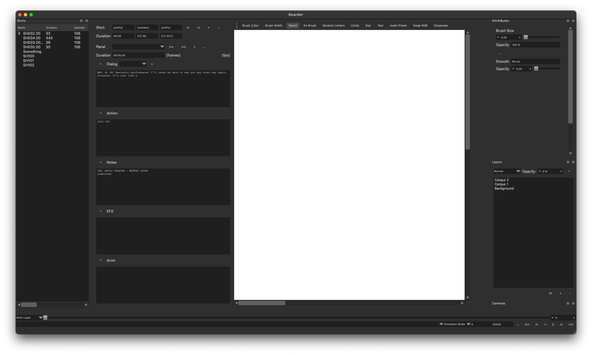

# B-Line

**B-Line: A streamlined storyboarding tool that empowers filmmakers, animators, and game producers.**


## Project Status

B-Line is currently in early development, despite initial work beginning in 2018. It lays the foundation for organizing shots, sketching scenes, and annotating storyboards. While the basic UI framework is in place, many components are still in progress. Several core features will be released soon after code review, with more enhancements to follow as development continues.

## Overview

B-Line is an open-source professional-grade storyboarding application built with Qt 6 and C++ for Windows, macOS and Linux. It features a clean, dark-themed interface designed for technical users who need precise control and detailed editing capabilities for visual storytelling.



*The B-Line main interface with canvas area, shot management, drawing tools, and layers*

## Current Features

### Shot Management
- **Shot Panel:** Organize your storyboard with a sequential shot structure
- **Shot Identifiers:** Systematic naming convention (e.g., SH0101.00 - SH0109.00)
- **Duration Tracking:** Set and monitor the frame duration for each shot
- **Organization:** Create and manage sequences of shots with descriptions

### Drawing & Annotation
- **Vector Drawing Tools:** Basic implementation of drawing tools for sketching storyboard frames
- **Brush Settings:** Customize size, color, smoothing, and opacity
- **Layer System:** Non-destructive editing with support for multiple layers (Background, Character, Effects)

### Shot Details
- **Dialog Section:** Add dialogue and audio cues to each shot
- **Action Description:** Document character movements and scene activity
- **Notes:** Add general comments and production notes
- **Camera Controls:** Define camera angles and movements

## Shot Panel System

The shot panel is the core of the storyboard workflow, allowing detailed organization and annotation of each visual element in your story.


*The shot panel interface showing shot organization, dialog, and action notes*

## Technical Details

- **Built with Qt 6:** Leveraging Qt's powerful cross-platform capabilities
- **C++ Core:** Performance-optimized backend for responsive drawing and editing
- **Animation Support:** Foundational elements for animation layer controls and playback
- **Vector-Based:** Precision drawing with scalable graphics

## Upcoming Features

The following components are under development and will be released after code review:

- Advanced vector drawing with Bezier curves
- Script import and automatic shot generation
- Timeline view for sequence management
- Camera preset library
- Animation controls
- Export to various industry formats

## Installation

### Prerequisites
- Qt 6.5 or higher
- C++17 compatible compiler
- CMake 3.16+

### Building from Source

```bash
# Clone the repository
git clone https://github.com/gamefusion/b-line.git
cd b-line

# Create build directory
qmake Boarder.pro 
cd build
make

# Run the application
./bin/b-line
```

## Contributing

Contributions are welcome! Please check out our [Contributing Guide (coming soon)](CONTRIBUTING.md) for details on how to get involved.

## License

B-Line is released under the MIT License. See the [LICENSE](LICENSE) file for more details.
