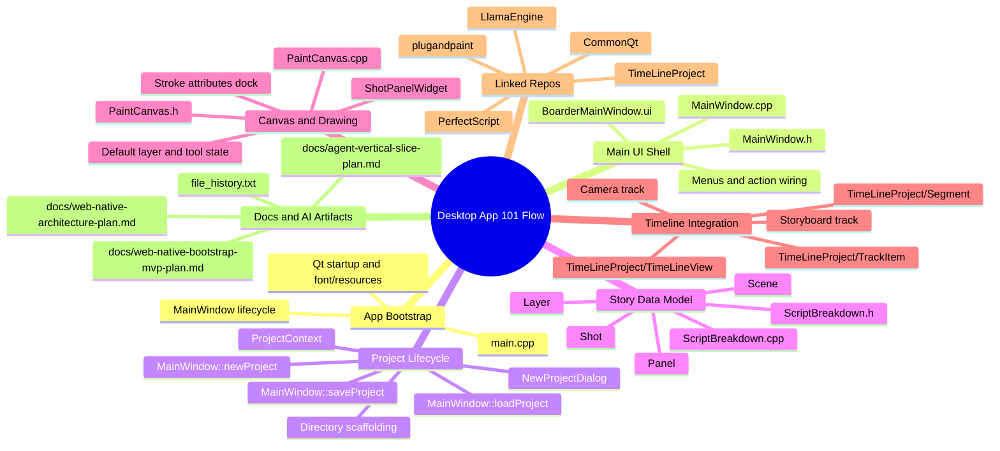

# Stargit/Boarder Desktop 101 Architecture Mind Map

> Goal: give an execution agent a high-signal map of where the 101 local workflow is implemented.

## Mental Model (Execution-Oriented)

1. `main.cpp` initializes app and opens `MainWindow`.
2. `MainWindow` owns the user journey and orchestrates:
- project creation/loading/saving
- scene/shot/panel data hydration
- paint area wiring
- timeline wiring
3. `ScriptBreakdown` is the narrative data backbone (scene -> shot -> panel -> layers).
4. `PaintCanvas` + panel widgets handle visible drawing behavior.
5. `TimeLineProject` owns temporal visualization and editing model.
6. 101 onboarding quality depends on defaults across all three:
- project defaults
- initial story object creation
- immediate draw-ready UI state

## High-Value File Pointers
- `/Users/andreascarlen/GameFusion/Applications/Boarder/main.cpp`
- `/Users/andreascarlen/GameFusion/Applications/Boarder/MainWindow.cpp`
- `/Users/andreascarlen/GameFusion/Applications/Boarder/MainWindow.h`
- `/Users/andreascarlen/GameFusion/Applications/Boarder/BoarderMainWindow.ui`
- `/Users/andreascarlen/GameFusion/Applications/Boarder/NewProjectDialog.cpp`
- `/Users/andreascarlen/GameFusion/Applications/Boarder/ProjectContext.h`
- `/Users/andreascarlen/GameFusion/Applications/Boarder/ScriptBreakdown.cpp`
- `/Users/andreascarlen/GameFusion/Applications/Boarder/ScriptBreakdown.h`
- `/Users/andreascarlen/GameFusion/Applications/Boarder/PaintCanvas.cpp`
- `/Users/andreascarlen/GameFusion/Applications/Boarder/PaintCanvas.h`
- `/Users/andreascarlen/GameFusion/Applications/Boarder/ShotPanelWidget.cpp`
- `/Users/andreascarlen/GameFusion/Applications/TimeLineProject/TimeLineView.cpp`
- `/Users/andreascarlen/GameFusion/Applications/TimeLineProject/TrackItem.cpp`
- `/Users/andreascarlen/GameFusion/Applications/TimeLineProject/Segment.cpp`

## Past AI Artifacts to Reuse
- `/Users/andreascarlen/GameFusion/Applications/Boarder/docs/web-native-architecture-plan.md`
- `/Users/andreascarlen/GameFusion/Applications/Boarder/docs/web-native-bootstrap-mvp-plan.md`
- `/Users/andreascarlen/GameFusion/Applications/Boarder/docs/agent-vertical-slice-plan.md`
- `/Users/andreascarlen/GameFusion/Applications/Boarder/file_history.txt`
